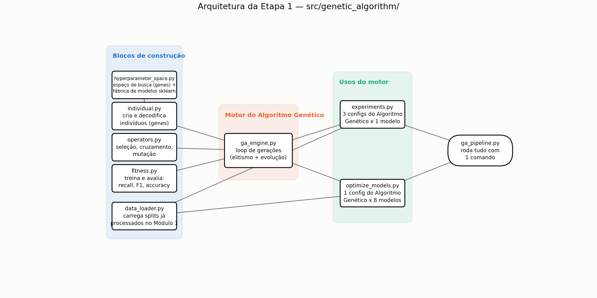

# TECH CHALLENGE — FASE 2 — PROJETO 1

## Otimização de Modelos de Diagnóstico

Este projeto dá continuidade ao sistema de suporte à decisão clínica desenvolvido na Fase 1 (diagnóstico de câncer de mama via Machine Learning). O desafio da Fase 2 pede duas capacidades novas sobre esses modelos: **otimização via Algoritmos Genéticos** e **interpretação via LLM**, além de **recursos de escalabilidade e observabilidade**.

## Contexto: o projeto base (Fase 1 / Módulo 1)

A Fase 1 já entregou um pipeline completo de Machine Learning para o **Breast Cancer Wisconsin Dataset** (569 amostras, 30 features, classificação binária Maligno/Benigno). Esse pipeline **não foi alterado** nesta fase — ele é usado como baseline fixo para medir o quanto o Algoritmo Genético melhora cada modelo.

- Código: `src/machine_learning/` e `src/pipeline/training_pipeline.py`
- Modelos treinados com hiperparâmetros fixos, salvos em `models/machine_learning/*.pkl`
- Critério de seleção: Recall da classe Maligno (1º), Precision (2º desempate), F1 (3º desempate) — porque um falso negativo (câncer não detectado) é clinicamente muito mais grave que um falso positivo
- Detalhes completos: [docs/arquitetura.md](docs/arquitetura.md) e [docs/testes.md](docs/testes.md)

---

## Etapa 1 — Otimização via Algoritmos Genéticos

### Objetivo

Usar um **Algoritmo Genético** para buscar hiperparâmetros melhores para cada um dos 8 modelos da Fase 1, comparando o resultado com o modelo original (hiperparâmetros fixos), e experimentar diferentes configurações do próprio Algoritmo Genético (tamanho de população, taxa de mutação, nº de gerações).

### Por que Algoritmo Genético (e não Grid Search)?

Testar todas as combinações de hiperparâmetros (grid search) cresce exponencialmente com o número de parâmetros. Um Algoritmo Genético evolui uma população de configurações candidatas ao longo de gerações — mantendo as melhores (elitismo) e gerando novas combinações via cruzamento e mutação — encontrando boas soluções sem precisar testar o espaço inteiro.

### Arquitetura do módulo `src/genetic_algorithm/`



### O que cada arquivo faz

| Arquivo | Responsabilidade |
|---|---|
| [hyperparameter_space.py](src/genetic_algorithm/hyperparameter_space.py) | Define, para cada um dos 8 modelos, quais hiperparâmetros o Algoritmo Genético pode ajustar e seus limites (`GENE_SPACES`); define os parâmetros fixos que **nunca** mudam em relação ao baseline (`FIXED_PARAMS`, ex: `random_state`); monta o modelo sklearn final (`build_model`) |
| [individual.py](src/genetic_algorithm/individual.py) | Um "indivíduo" = um dicionário `{hiperparâmetro: valor}`. Sorteia indivíduos aleatórios dentro do espaço de busca e os decodifica em modelos sklearn prontos para treinar |
| [operators.py](src/genetic_algorithm/operators.py) | Os 3 operadores genéticos: seleção por torneio, cruzamento uniforme e mutação por reset aleatório |
| [fitness.py](src/genetic_algorithm/fitness.py) | Treina o modelo candidato no treino, avalia na validação, e calcula 1 score combinando Recall, F1 e Accuracy |
| [data_loader.py](src/genetic_algorithm/data_loader.py) | Carrega os splits (`X_train`, `X_val`, `X_test`...) já processados pelo Módulo 1, garantindo comparação justa (mesmos dados) |
| [ga_engine.py](src/genetic_algorithm/ga_engine.py) | O algoritmo genético em si: por geração, avalia toda a população, preserva os melhores (elitismo) e gera o restante via seleção + cruzamento + mutação |
| [experiments.py](src/genetic_algorithm/experiments.py) | Roda 3 configurações diferentes do Algoritmo Genético no mesmo modelo, comparando convergência |
| [optimize_models.py](src/genetic_algorithm/optimize_models.py) | Roda o Algoritmo Genético nos 8 modelos e compara cada um com sua versão original |
| [ga_pipeline.py](src/pipeline/ga_pipeline.py) | Orquestra `experiments.py` + `optimize_models.py` em um único comando |

### Codificação dos genes (hiperparâmetros otimizados por modelo)

| Modelo | Hiperparâmetros otimizados pelo Algoritmo Genético | Fixos (iguais ao baseline) |
|---|---|---|
| Logistic Regression | `C` (log-scale) | `max_iter`, `random_state` |
| Random Forest | `n_estimators`, `max_depth`, `min_samples_split`, `min_samples_leaf`, `max_features` | `random_state` |
| Decision Tree | `max_depth`, `min_samples_split`, `min_samples_leaf`, `criterion` | `random_state` |
| KNN | `n_neighbors`, `weights`, `p` | — |
| SVM | `C` (log-scale), `kernel`, `gamma` | `probability`, `random_state` |
| Gradient Boosting | `n_estimators`, `learning_rate` (log-scale), `max_depth`, `subsample` | `random_state` |
| Extra Trees | `n_estimators`, `max_depth`, `min_samples_split`, `min_samples_leaf` | `random_state` |
| MLP | `hidden_layer_sizes`, `alpha` (log-scale), `learning_rate_init` (log-scale) | `max_iter`, `random_state` |

Cada gene é sorteado/mutado de acordo com seu tipo: inteiro (`int`), decimal em escala linear ou logarítmica (`float`, log-scale usado em `C`, `alpha`, `learning_rate` — parâmetros que variam em ordens de grandeza), ou escolha entre opções fixas (`choice`).

**Regra de design importante:** apenas hiperparâmetros de *modelagem* (que afetam como o modelo aprende) viram genes. Parâmetros de *infraestrutura* (`random_state`, `probability`, `max_iter`) ficam fixos e idênticos ao baseline — isso isola a comparação para que qualquer ganho de desempenho venha só da otimização de hiperparâmetros, não de mudanças acidentais em parâmetros técnicos.

### Função fitness

```
fitness = 0.60 × Recall(Maligno) + 0.25 × F1(Maligno) + 0.15 × Accuracy
```

Os mesmos pesos priorizam Recall porque um falso negativo (câncer não detectado) é o erro mais grave clinicamente — consistente com o critério de seleção já usado no Módulo 1.

### Operadores genéticos

- **Seleção por torneio** (`tournament_size=3`): sorteia alguns indivíduos e escolhe o de maior fitness — simples e evita convergência prematura
- **Cruzamento uniforme**: cada gene do filho vem aleatoriamente de um dos dois pais (não há ordem espacial entre hiperparâmetros que justifique cruzamento por ponto de corte)
- **Mutação por reset aleatório**: cada gene tem uma chance de ser resorteado do zero dentro do espaço de busca — funciona igual para genes numéricos e categóricos
- **Elitismo**: os N melhores indivíduos de cada geração passam direto para a próxima, sem risco de serem perdidos

### Como executar

```powershell
# Roda tudo (3 experimentos + otimização dos 8 modelos)
python -m src.pipeline.ga_pipeline

# Ou separadamente:
python -m src.genetic_algorithm.experiments      # 3 experimentos com configs diferentes do Algoritmo Genético
python -m src.genetic_algorithm.optimize_models  # otimiza os 8 modelos e compara com o baseline
```

**Saídas geradas:**

```
reports/ga_optimization/
├── experiments_summary.csv          # resumo dos 3 experimentos
├── experiments_convergence.png      # gráfico de convergência (fitness x geração)
├── comparison_baseline_vs_ga.csv    # comparativo original x otimizado (8 modelos)
└── best_hyperparameters.json        # melhores hiperparâmetros encontrados por modelo

models/ga_optimized/
└── <nome_do_modelo>.pkl             # os 8 modelos otimizados, prontos para uso
```

### Experimento: efeito da configuração do Algoritmo Genético na convergência

Rodamos o mesmo modelo (`decision_tree`) com 3 configurações diferentes de população/mutação/gerações:

| Experimento | População | Gerações | Taxa de mutação | Melhor Fitness |
|---|---|---|---|---|
| Exp1 — população pequena | 10 | 10 | 0.05 | 0.9334 |
| Exp2 — população média | 20 | 12 | 0.20 | 0.9334 |
| Exp3 — população grande + mutação alta | 30 | 15 | 0.40 | **0.9383** |


**Achado:** o Exp3 (população maior + mutação mais alta) escapou de um ótimo local na geração 4 e encontrou uma solução melhor — algo que Exp1 e Exp2 não conseguiram durante todo o experimento. Isso demonstra, na prática, por que população e mutação afetam a capacidade de exploração do algoritmo genético.

### Resultado: modelos otimizados x originais

| Modelo | Recall original | Recall otimizado | F1 original | F1 otimizado | Accuracy original | Accuracy otimizada | Ganho de Recall |
|---|---|---|---|---|---|---|---|
| Decision Tree | 0.8824 | **0.9412** | 0.8824 | **0.9275** | 0.9121 | **0.9451** | +5.88 pp |
| Gradient Boosting | 0.9118 | **0.9706** | 0.9394 | **0.9706** | 0.9560 | **0.9780** | +5.88 pp |
| KNN | 0.9412 | **0.9706** | 0.9552 | **0.9565** | 0.9670 | 0.9670 | +2.94 pp |
| Random Forest | 0.9412 | 0.9412 | 0.9552 | 0.9552 | 0.9670 | 0.9670 | 0 |
| Logistic Regression | 0.9706 | 0.9706 | 0.9565 | 0.9565 | 0.9670 | 0.9670 | 0 |
| SVM | 0.9706 | 0.9706 | 0.9851 | 0.9851 | 0.9890 | 0.9890 | 0 |
| Extra Trees | 0.9412 | 0.9412 | 0.9552 | **0.9697** | 0.9670 | **0.9780** | 0 (F1/Acc melhoram) |
| MLP | 0.9706 | 0.9706 | 0.9565 | **0.9851** | 0.9670 | **0.9890** | 0 (F1/Acc melhoram) |

- **3 modelos com ganho real de Recall**: Decision Tree, Gradient Boosting e KNN — o Algoritmo Genético encontrou hiperparâmetros que detectam mais casos malignos que o baseline.
- **2 modelos sem ganho de Recall, mas com F1/Accuracy melhores**: Extra Trees e MLP — o Algoritmo Genético achou configurações com menos falsos positivos, mantendo o mesmo Recall.
- **3 modelos sem nenhum ganho** (Random Forest, Logistic Regression, SVM): já operavam no teto de desempenho possível para este dataset — resultado esperado, não uma falha do Algoritmo Genético.

Dados completos em [reports/ga_optimization/comparison_baseline_vs_ga.csv](reports/ga_optimization/comparison_baseline_vs_ga.csv) e hiperparâmetros encontrados em [reports/ga_optimization/best_hyperparameters.json](reports/ga_optimization/best_hyperparameters.json).

### Decisões e desafios da Etapa 1

- **Dataset pequeno demais para diferenciar todo modelo**: o conjunto de validação tem só 91 amostras. Modelos como Random Forest, SVM e Logistic Regression já operam perto do teto de desempenho possível nesse dataset, então o Algoritmo Genético não encontra ganho de Recall para eles — o que é um resultado válido, não uma falha do algoritmo.
- **Depreciação do `penalty` na Logistic Regression**: a versão do scikit-learn usada no projeto (1.8) emitia `FutureWarning` ao variar `penalty` junto com `solver="liblinear"`. Solução: remover `penalty` do espaço de busca e manter apenas `C`, evitando o warning sem perder um hiperparâmetro relevante.
- **Escolha do modelo de referência nos experimentos**: inicialmente os 3 experimentos rodavam em `random_forest`, mas como esse modelo satura no teto de desempenho já na 1ª geração, os 3 gráficos ficavam idênticos (retos) — sem valor demonstrativo. Trocado para `decision_tree`, que tem espaço real de melhoria e mostra o efeito da configuração do Algoritmo Genético.

### Próximos passos

- **Etapa 2**: configurar escalabilidade automática, monitoramento e logging de desempenho, e documentar a arquitetura e decisões de implementação.
- **Etapa 3**: integrar uma LLM pré-treinada para gerar explicações em linguagem natural dos diagnósticos e interpretar os resultados dos modelos para profissionais de saúde.

---

## Estrutura do projeto

```
├── data/
│   └── machine_learning/
│       ├── raw/                       # dados originais (Fase 1)
│       └── processed/                 # splits treino/val/teste (Fase 1)
├── docs/
│   ├── arquitetura.md                 # arquitetura do Módulo 1 (Fase 1)
│   └── testes.md                      # estratégia de testes do Módulo 1 (Fase 1)
├── models/
│   ├── machine_learning/
│   │   └── *.pkl                      # modelos originais (Fase 1)
│   └── ga_optimized/
│       └── *.pkl                      # modelos otimizados pelo Algoritmo Genético (Etapa 1)
├── notebooks/
│   └── eda.ipynb                      # análise exploratória (Fase 1)
├── reports/
│   └── ga_optimization/               # resultados da Etapa 1 (CSVs, JSON, gráfico)
├── src/
│   ├── machine_learning/              # pipeline de ML da Fase 1 (não alterado)
│   ├── genetic_algorithm/             # módulo novo da Etapa 1
│   │   ├── hyperparameter_space.py
│   │   ├── individual.py
│   │   ├── operators.py
│   │   ├── fitness.py
│   │   ├── data_loader.py
│   │   ├── ga_engine.py
│   │   ├── experiments.py
│   │   └── optimize_models.py
│   └── pipeline/
│       ├── training_pipeline.py       # orquestrador da Fase 1
│       └── ga_pipeline.py             # orquestrador da Etapa 1
└── requirements.txt
```

## Tecnologias

- Python
- scikit-learn (modelos, métricas)
- pandas / NumPy (manipulação de dados)
- Matplotlib (gráfico de convergência do Algoritmo Genético)
- joblib (persistência de modelos)

## Como executar o projeto completo

```powershell
# 1. Ambiente virtual
python -m venv .venv
.venv\Scripts\activate

# 2. Dependências
pip install -r requirements.txt

# 3. Pipeline da Fase 1 (treina os modelos originais)
python -m src.pipeline.training_pipeline

# 4. Pipeline da Etapa 1 (otimização via Algoritmo Genético)
python -m src.pipeline.ga_pipeline
```
